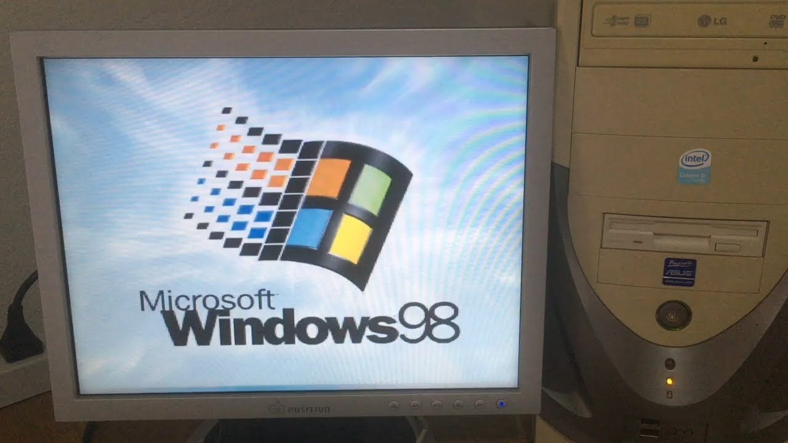

# Introdução a Linguagem de Marcação (MD)
## 2 semestre 2026 - Dev A
### Inicio com Markdown

Vamos iniciar falando da hierarquia e estilos simples.

Exemplo de uso da estilização em negrito **Palavra de exemplo** utiliza-se **.

Exemplo de uso da estilização em itálico *Palavra de exemplo* utiliza-se *.

Exemplo de uso da estilização em tachado ~~Palavra de exemplo~~ utiliza-se ~~.

# Lista de compras

- Arroz
- Feijão
- Abacate
  - verde

1. Primeiro passo
2. Segundo passo


Acesse o [google](https://www.google.com.br)


Exemplo de trecho de código:
```javascript
function boasVindas(nome) {
  console.log(`ola, ${nome}!`);
}
```
## Exemplo de tabelas 

| Recurso | Suporte | Status |
| :--- |:--- |:--- |
| html | Sim | Ativo |
| Markdown | sim | Ativo |


